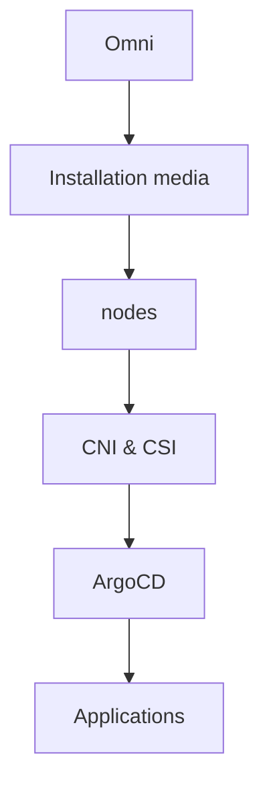

# Installation Guide

## Prerequisites

### Infrastructure Requirements
- **vSphere environment** with sufficient resources
- **3 VMs** for Kubernetes control planes (minimum 4 CPU, 8GB RAM each)
- **Network connectivity** to internet for image pulls
- **DNS resolution** for `*.apps.lab.mxe11.nl` domain

### Access Requirements
- **Sidero Omni account** with cluster management access
- **kubectl** configured for target cluster
- **Git access** to this repository

### Network Configuration
- **Cluster network**: 172.16.20.0/24
- **Node IPs**: 172.16.20.51-53
- **VIP**: 172.16.20.250 (Kubernetes API)
- **LoadBalancer range**: 172.16.20.100-150

## Order of Operations



## Quick Installation

### 1. Bootstrap Platform

```bash
# Clone repository
git clone https://github.com/matjahs/omni-gitops.git
cd omni-gitops

# Run single-command bootstrap
./bootstrap.sh
```

The bootstrap script will:
1. Install ArgoCD in the cluster
2. Wait for ArgoCD to be ready
3. Apply platform applications
4. Set up GitOps automation

### 2. Access ArgoCD

```bash
# Get admin password
kubectl -n argocd get secret argocd-initial-admin-secret \
  -o jsonpath="{.data.password}" | base64 -d

# Port forward (temporary access)
kubectl port-forward svc/argocd-server -n argocd 8080:443
```

Open https://localhost:8080 and login with:
- Username: `admin`
- Password: (from command above)

### 3. Verify Installation

```bash
# Check ArgoCD applications
kubectl get applications -n argocd

# Check platform services
kubectl get pods -n traefik-system
kubectl get pods -n metallb-system
kubectl get pods -n kube-system -l app.kubernetes.io/name=metrics-server
```

## Detailed Installation Steps

### Phase 1: Cluster Preparation

**Talos Cluster Setup (via Omni):**
1. Access [Omni Dashboard](https://matjahs.eu-central-1.omni.siderolabs.io/cluster1)
2. Apply cluster template from `clusters/dev/cluster-template.yaml`
3. Wait for cluster bootstrap and Cilium installation
4. Download kubeconfig and configure kubectl

**Verify Cluster Health:**
```bash
# Check nodes
kubectl get nodes -o wide

# Check CNI
kubectl get pods -n kube-system -l k8s-app=cilium

# Check cluster info
kubectl cluster-info
```

### Phase 2: ArgoCD Bootstrap

The `bootstrap.sh` script performs these steps:

```bash
# Install ArgoCD
kubectl apply -k bootstrap/argocd/

# Wait for readiness
kubectl wait --for=condition=available --timeout=300s \
  deployment/argocd-server -n argocd

# Apply platform apps
kubectl apply -k platform/
```

**Manual alternative:**
```bash
# Install ArgoCD manually
kubectl create namespace argocd
kubectl apply -n argocd -f \
  https://raw.githubusercontent.com/argoproj/argo-cd/stable/manifests/install.yaml

# Apply custom configuration
kubectl apply -k bootstrap/argocd/overlays/production/
```

### Phase 3: Platform Services

ArgoCD will automatically deploy:

1. **ArgoCD** (self-managed)
   - Location: `argocd` namespace
   - URL: https://cd.apps.lab.mxe11.nl

2. **Traefik** (ingress controller)
   - Location: `traefik-system` namespace
   - Dashboard: https://traefik.apps.lab.mxe11.nl/dashboard

3. **MetalLB** (load balancer)
   - Location: `metallb-system` namespace
   - IP Pool: 172.16.20.100-150

4. **Metrics Server** (HPA support)
   - Location: `kube-system` namespace
   - Metrics: kubectl top nodes/pods

## Configuration

### ArgoCD Access

**Production URL:**
https://cd.apps.lab.mxe11.nl

**GitHub Authentication:**
Configured for `argoproj` organization members

**RBAC:**
- Admin: GitHub team members
- Readonly: Anonymous users

### Traefik Configuration

**HTTPS:**
- Automatic Let's Encrypt certificates
- HTTP to HTTPS redirect
- ACME challenge via HTTP-01

**Dashboard:**
Access via https://traefik.apps.lab.mxe11.nl/dashboard

### MetalLB Configuration

**IP Address Pool:**
```yaml
apiVersion: metallb.io/v1beta1
kind: IPAddressPool
metadata:
  name: default-pool
spec:
  addresses:
  - 172.16.20.100-172.16.20.150
```

## Troubleshooting

### ArgoCD Not Starting
```bash
# Check ArgoCD pods
kubectl get pods -n argocd

# Check ArgoCD logs
kubectl logs -n argocd deployment/argocd-server

# Restart ArgoCD
kubectl rollout restart deployment/argocd-server -n argocd
```

### Applications Not Syncing
```bash
# Check application status
kubectl get applications -n argocd

# Describe specific application
kubectl describe application traefik -n argocd

# Manual sync
kubectl patch application traefik -n argocd \
  --type merge -p '{"operation":{"initiatedBy":{"username":"admin"},"sync":{}}}'
```

### Network Issues
```bash
# Check Cilium
kubectl get pods -n kube-system -l k8s-app=cilium

# Check MetalLB
kubectl get pods -n metallb-system

# Check LoadBalancer services
kubectl get svc --all-namespaces -o wide
```

## Next Steps

1. **Set up monitoring** - Deploy Prometheus/Grafana
2. **Add applications** - Follow [application deployment guide](application-deployment.md)
3. **Configure backups** - Set up Velero for application data
4. **Enable observability** - Configure logging and tracing
