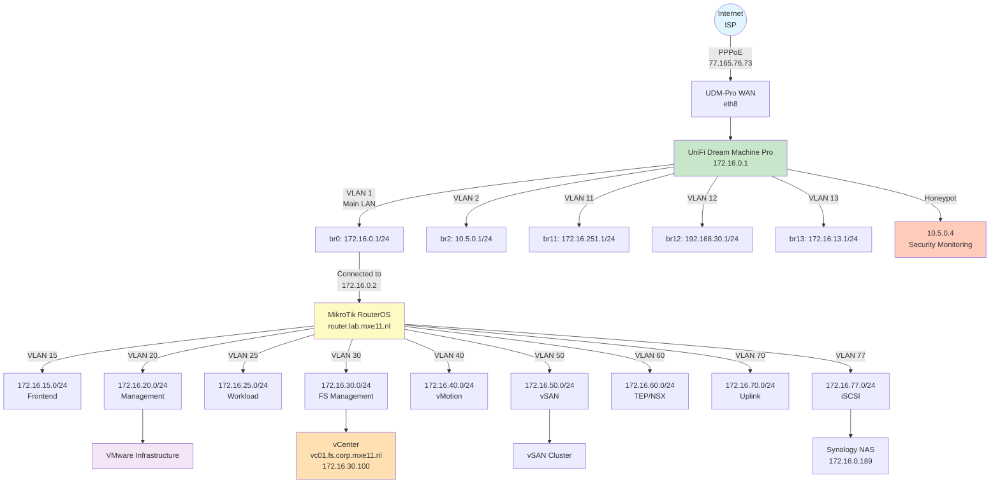
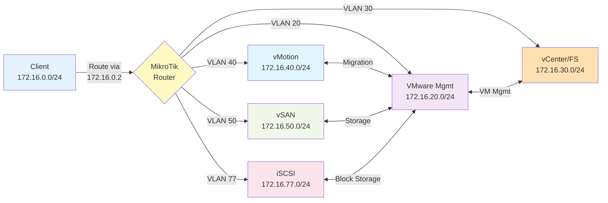
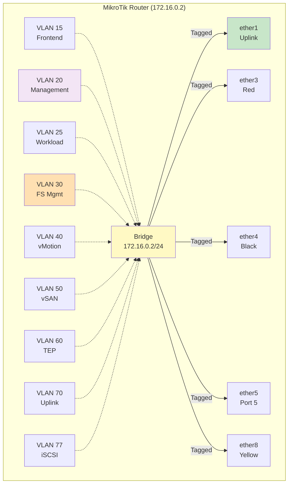
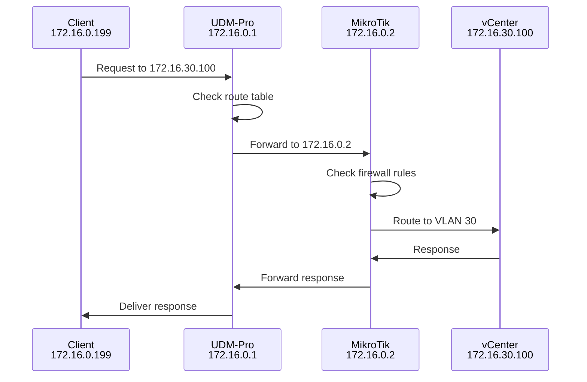
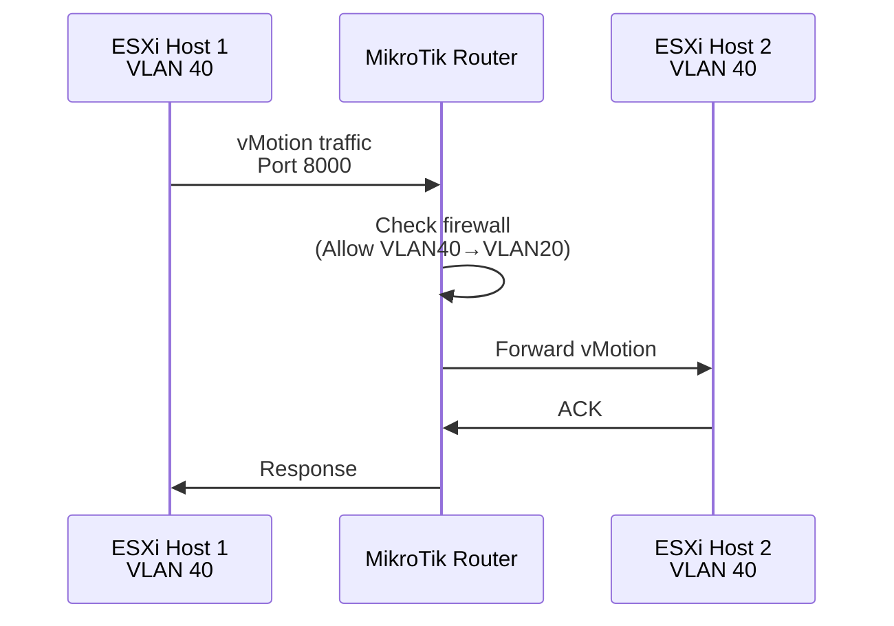
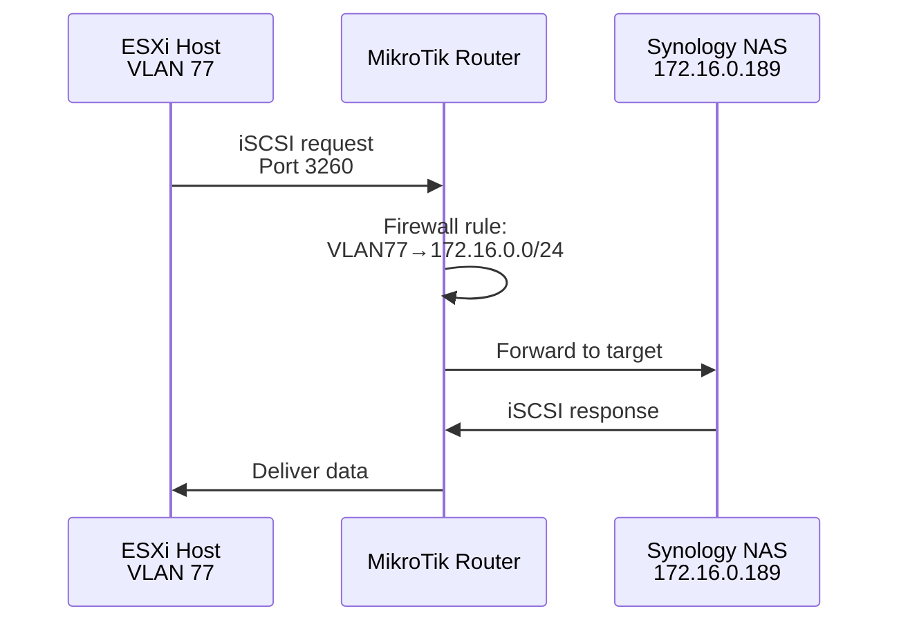

# Network Topology

## Physical Network Diagram

## Logical Network Flow

## VLAN Bridge Architecture (MikroTik)

## Traffic Flow Examples

### 1. Client to vCenter Access

### 2. VMware vMotion Traffic

### 3. iSCSI Storage Access

## Port Connectivity Matrix

| Port | Interface | Link Status | Speed | VLANs Tagged | Purpose |
|------|-----------|-------------|-------|--------------|---------|
| eth1 | ether1 | UP | 9216 MTU | 15,20,25,30,40,50,60,70,77 | Uplink |
| eth3 | ether3 | UP | 9216 MTU | 15,20,25,30,40,50,60,70,77 | Red |
| eth4 | ether4 | UP | 9216 MTU | 15,20,25,30,40,50,60,70,77 | Black |
| eth5 | ether5 | UP | 9216 MTU | 15,20,25,30,40,50,60,70,77 | Port 5 |
| eth8 | ether8 | UP | 9216 MTU | 15,20,25,30,40,50,60,70,77 | Yellow |
| SFP+ 1 | sfp-sfpplus1 | UP | 9216 MTU | Tagged only | Fiber uplink |
| SFP+ 2 | sfp-sfpplus2 | UP | 9216 MTU | VLAN 77 (PVID) | iSCSI dedicated |

## Network Metrics

### UDM-Pro Statistics
- **Uptime**: 23+ days
- **WAN Traffic**: 1.0 TiB RX / 253.8 GiB TX
- **Connection Tracking**: 2,925 / 65,536 (4.5%)
- **Active TCP**: 124 established connections
- **ARP Entries**: 667 total, 28 reachable

### MikroTik Statistics
- **VLAN 30 Traffic**: 487 MB RX / 112 GB TX
- **Bridge VLAN Filtering**: Enabled
- **Hardware Offload**: Active on all ports
