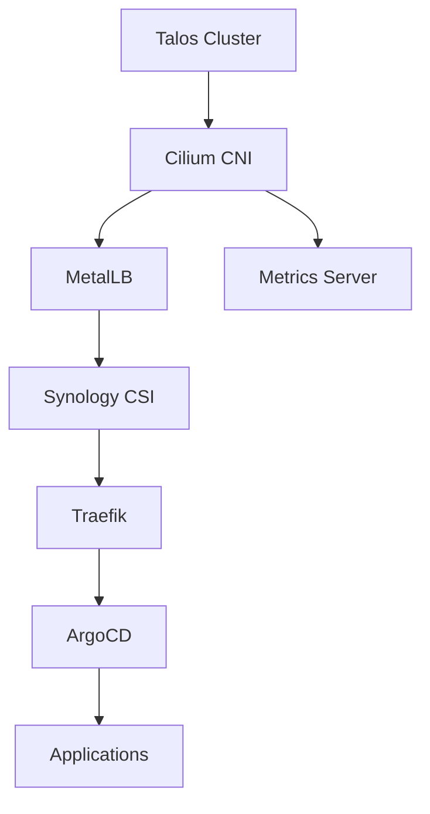

# Platform Components

## Overview

The platform consists of five core components managed in a GitOps pattern. Each component is defined in the repository and automatically deployed and maintained.

## ArgoCD (GitOps Engine)

**Purpose:** Continuous delivery and configuration management
**Namespace:** `argocd`
**Repository:** Self-managed via `applications/argocd.yaml`

### Features
- **Self-Managing:** ArgoCD manages its own configuration
- **GitHub Integration:** SSO with GitHub organization
- **Notifications:** GitHub commit status updates
- **Web UI:** https://cd.apps.lab.mxe11.nl
- **API Access:** Full REST API for automation

### Configuration Highlights
```yaml
# High Availability
replicas: 3

# Authentication
dex.config:
  connectors:
  - type: github
    config:
      orgs:
      - name: argoproj

# Sync Policies
syncPolicy:
  automated:
    prune: true
    selfHeal: true
```

### Key Files
- `clusters/cluster1/kustomization.yaml` - Base installation
- `clusters/cluster1/overlays/production/` - Production overrides
- `applications/argocd.yaml` - Self-management application

### Monitoring
```bash
# Check ArgoCD health
kubectl get applications -n argocd

# View application details
argocd app get <app-name>

# Application sync status
argocd app sync <app-name>
```

## Traefik (Ingress Controller)

**Purpose:** HTTP/HTTPS ingress and load balancing
**Namespace:** `traefik-system`
**Repository:** `apps/traefik/`

### Features
- **Automatic HTTPS:** Let's Encrypt integration
- **Multiple Protocols:** HTTP, HTTPS, TCP, UDP
- **Service Discovery:** Kubernetes Ingress + CRDs
- **Dashboard:** Built-in monitoring UI
- **Metrics:** Prometheus endpoint

### Configuration
```yaml
# Entry Points
entryPoints:
  web:
    address: ":80"
    http:
      redirections:
        entrypoint:
          to: websecure
          scheme: https
  websecure:
    address: ":443"

# Certificate Resolution
certificatesResolvers:
  letsencrypt:
    acme:
      email: your-email@example.com
      storage: /data/acme.json
      httpChallenge:
        entryPoint: web
```

### Service Types
- **LoadBalancer:** External access via MetalLB
- **ClusterIP:** Dashboard access (traefik-dashboard service)

### Access Points
- **Dashboard:** https://traefik.apps.lab.mxe11.nl/dashboard
- **API:** https://traefik.apps.lab.mxe11.nl/api
- **Metrics:** http://traefik.traefik-system.svc.cluster.local:8080/metrics

### Monitoring
```bash
# Check Traefik pods
kubectl get pods -n traefik-system

# View Traefik logs
kubectl logs -n traefik-system deployment/traefik

# Check ingress resources
kubectl get ingress --all-namespaces
```

## MetalLB (Load Balancer)

**Purpose:** Bare metal load balancing for Kubernetes services
**Namespace:** `metallb-system`
**Repository:** Helm chart from https://metallb.github.io/metallb

### Features
- **Layer 2 Mode:** ARP-based IP assignment
- **IP Pool Management:** Configurable address ranges
- **Service Integration:** Automatic LoadBalancer service support
- **BGP Ready:** Future BGP mode capability

### Configuration
```yaml
# IP Address Pool
apiVersion: metallb.io/v1beta1
kind: IPAddressPool
metadata:
  name: default-pool
spec:
  addresses:
  - 172.16.20.100-172.16.20.150

# L2 Advertisement
apiVersion: metallb.io/v1beta1
kind: L2Advertisement
metadata:
  name: default
spec:
  ipAddressPools:
  - default-pool
```

### Service Integration
```yaml
# Example LoadBalancer service
apiVersion: v1
kind: Service
metadata:
  name: example-app
spec:
  type: LoadBalancer  # MetalLB assigns external IP
  ports:
  - port: 80
    targetPort: 8080
  selector:
    app: example-app
```

### Monitoring
```bash
# Check MetalLB controller
kubectl get pods -n metallb-system

# View IP assignments
kubectl get svc --all-namespaces -o wide | grep LoadBalancer

# Check MetalLB configuration
kubectl get ipaddresspool -n metallb-system
kubectl get l2advertisement -n metallb-system
```

## Synology CSI (Persistent Storage)

**Purpose:** Network-attached persistent volumes backed by the Synology NAS
**Namespace:** `synology-csi`
**Repository:** `flux/releases/synology-csi.yaml`

### Features
- **NAS Integration:** Uses the official Synology CSI driver (`csi.san.synology.com`)
- **Secret Management:** Credentials sourced from Vault via ExternalSecret
- **Snapshot Support:** Installs a default VolumeSnapshotClass (deletion policy `Delete`)
- **Single Storage Class:** Provides `synology-csi-synology-csi-synology-iscsi-storage` for iSCSI-backed PVCs

### Configuration Highlights
```yaml
# Helm values (excerpt)
clientInfoSecret:
  name: client-info-secret
  create: false
storageClasses:
  synology-iscsi-storage:
    reclaimPolicy: Delete
    volumeBindingMode: Immediate
    parameters:
      fsType: ext4
      dsm: "172.16.0.189"
      location: "/volume1"

# Vault-backed client info
apiVersion: external-secrets.io/v1beta1
kind: ExternalSecret
spec:
  target:
    name: client-info-secret
    template:
      data:
        client-info.yaml: |
          clients:
            - host: {{ .host }}
              port: 5000
              https: false
              username: {{ .username }}
              password: {{ .password }}
```

### Usage Examples
```bash
# Create a PersistentVolumeClaim
cat <<'EOF' | kubectl apply -f -
apiVersion: v1
kind: PersistentVolumeClaim
metadata:
  name: demo-synology-pvc
spec:
  accessModes:
    - ReadWriteOnce
  resources:
    requests:
      storage: 10Gi
  storageClassName: synology-csi-synology-csi-synology-iscsi-storage
EOF

# Inspect created volumes
kubectl get pvc,pv
```

### Monitoring
```bash
# Check driver pods
kubectl get pods -n synology-csi

# Inspect StorageClass and VolumeSnapshotClass
kubectl get storageclass synology-csi-synology-csi-synology-iscsi-storage
kubectl get volumesnapshotclass synology-csi-synology-csi-synology-snapshotclass

# Validate secret sync
kubectl get secret client-info-secret -n synology-csi -o yaml
```

## Metrics Server (Resource Metrics)

**Purpose:** Container and node resource metrics for HPA and kubectl top
**Namespace:** `kube-system`
**Repository:** `apps/metrics-server/`

### Features
- **Resource Metrics:** CPU and memory usage
- **HPA Support:** Horizontal Pod Autoscaler integration
- **kubectl Integration:** `kubectl top` command support
- **Secure:** TLS communication with kubelet

### Configuration
```yaml
# Deployment settings
args:
- --cert-dir=/tmp
- --secure-port=4443
- --kubelet-preferred-address-types=InternalIP,ExternalIP,Hostname
- --kubelet-use-node-status-port
- --metric-resolution=15s
- --kubelet-insecure-tls  # Required for some environments

# Resource limits
resources:
  requests:
    cpu: 100m
    memory: 200Mi
  limits:
    cpu: 200m
    memory: 400Mi
```

### API Integration
```yaml
# APIService registration
apiVersion: apiregistration.k8s.io/v1
kind: APIService
metadata:
  name: v1beta1.metrics.k8s.io
spec:
  service:
    name: metrics-server
    namespace: kube-system
  group: metrics.k8s.io
  version: v1beta1
  insecureSkipTLSVerify: true
```

### Usage Examples
```bash
# View node metrics
kubectl top nodes

# View pod metrics
kubectl top pods --all-namespaces

# HPA example
apiVersion: autoscaling/v2
kind: HorizontalPodAutoscaler
metadata:
  name: example-hpa
spec:
  scaleTargetRef:
    apiVersion: apps/v1
    kind: Deployment
    name: example-app
  minReplicas: 2
  maxReplicas: 10
  metrics:
  - type: Resource
    resource:
      name: cpu
      target:
        type: Utilization
        averageUtilization: 70
```

### Monitoring
```bash
# Check metrics-server health
kubectl get pods -n kube-system -l app.kubernetes.io/name=metrics-server

# Test metrics API
kubectl top nodes
kubectl top pods -n kube-system

# Check APIService
kubectl get apiservice v1beta1.metrics.k8s.io
```

## Platform Dependencies

### Startup Order
1. **Kubernetes Cluster** (Talos + Cilium)
2. **MetalLB** (for LoadBalancer services)
3. **Synology CSI** (requires the cluster but independent of networking stack)
4. **Traefik** (depends on MetalLB for external access)
5. **ArgoCD** (manages all components)
6. **Metrics Server** (independent, can start anytime)

### Service Dependencies


### Resource Requirements
| Component      | CPU Request | Memory Request | Workload Pattern          |
|----------------|-------------|----------------|---------------------------|
| ArgoCD         | 250m        | 256Mi          | Deployment (3 replicas)   |
| Traefik        | 200m        | 256Mi          | Deployment (2 replicas)   |
| MetalLB        | 100m        | 128Mi          | Controller + DaemonSet    |
| Synology CSI   | 250m        | 256Mi          | StatefulSet + DaemonSet   |
| Metrics Server | 100m        | 200Mi          | Deployment (1 replica)    |
